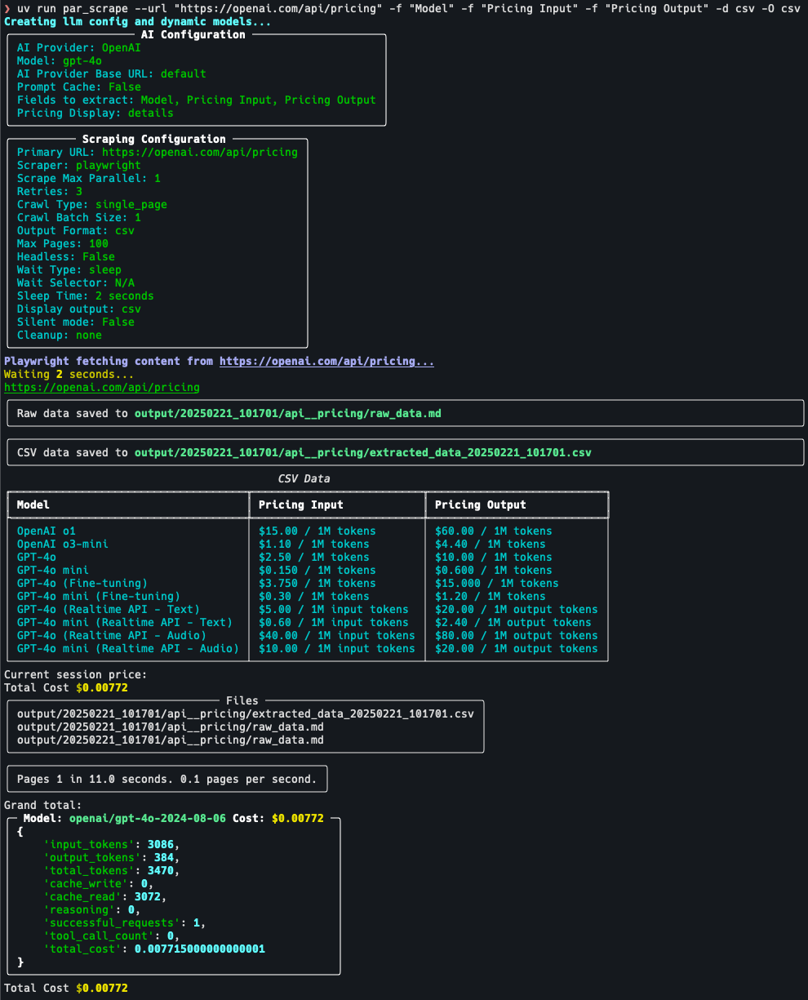

# PAR Scrape

PAR Scrape is a versatile web scraping tool with options for Selenium or Playwright, featuring OpenAI-powered data extraction and formatting.



## Features

- Web scraping using Selenium or Playwright
- OpenAI-powered data extraction and formatting
- Supports multiple output formats (JSON, Excel, CSV, Markdown)
- Customizable field extraction
- Token usage and cost estimation

## Installation

To install PAR Scrape, make sure you have Python 3.11 or higher and [uv](https://pypi.org/project/uv/) installed.

### Installation From Source

Then, follow these steps:

1. Clone the repository:
   ```bash
   git clone https://github.com/paulrobello/par_scrape.git
   cd par_scrape
   ```

2. Install the package dependencies using uv:
   ```bash
   uv sync
   ```
### Installation From PyPI

To install PAR Scrape from PyPI, run any of the following commands:

```bash
uv tool install par_scrape
```

```bash
pipx install par_scrape
```

## Usage

To use PAR Scrape, you can run it from the command line with various options. Here's a basic example:

### Running from source
```bash
uv run par_scrape --url "https://openai.com/api/pricing/" --fields "Model" --fields "Pricing Input" --fields "Pricing Output" --scraper selenium --model gpt-4o-mini --display-output md
```

### Running if installed from PyPI
```bash
par_scrape --url "https://openai.com/api/pricing/" --fields "Title" "Number of Points" "Creator" "Time Posted" "Number of Comments" --scraper selenium --model gpt-4o-mini --display-output md
```

### Options

- `--url`: The URL to scrape (default: "https://openai.com/api/pricing/")
- `--fields`: Fields to extract from the webpage (default: ["Model", "Pricing Input", "Pricing Output"])
- `--scraper`: Scraper to use: 'selenium' or 'playwright' (default: "selenium")
- `--remove-output`: Remove output folder before running
- `--headless`: Run in headless mode (for Selenium) (default: True)
- `--model`: OpenAI model to use for processing (default: "gpt-4o-mini")
- `--display-output`: Display output in terminal (md, csv, or json)
- `--output-folder`: Specify the location of the output folder (default: "./output")
- `--silent`: Run in silent mode, suppressing output
- `--run-name`: Specify a name for this run
- `--cleanup`: Remove output folder before exiting

### Examples

1. Basic usage with default options:
```bash
par_scrape --url "https://openai.com/api/pricing/" --fields "Model" "Pricing Input" "Pricing Output"
```

2. Using Playwright and displaying JSON output:
```bash
par_scrape --url "https://example.com" --fields "Title" "Description" "Price" --scraper playwright --display-output json
```

3. Specifying a custom model and output folder:
```bash
par_scrape --url "https://example.com" --fields "Title" "Description" "Price" --model gpt-4 --output-folder ./custom_output
```

4. Running in silent mode with a custom run name:
```bash
par_scrape --url "https://example.com" --fields "Title" "Description" "Price" --silent --run-name my_custom_run
```

5. Using the cleanup option to remove the output folder after scraping:
```bash
par_scrape --url "https://example.com" --fields "Title" "Description" "Price" --cleanup
```

## Contributing

Contributions are welcome! Please feel free to submit a Pull Request.

## License

This project is licensed under the MIT License - see the [LICENSE](LICENSE) file for details.

## Author

Paul Robello - probello@gmail.com
