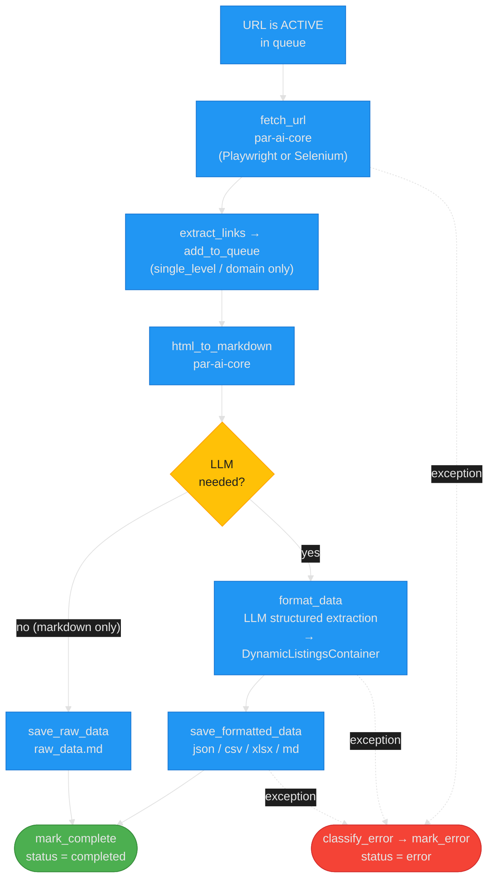

# Architecture: PAR Scrape

PAR Scrape is a CLI web scraper that fetches pages with Selenium or Playwright, converts the HTML to Markdown, and optionally runs an LLM to extract structured data into JSON, CSV, Excel, and Markdown outputs. This note describes the post-remediation module layout, the per-page data flow, the SQLite-backed crawl queue, and the database schema.

## Table of Contents

- [Module Map](#module-map)
- [Data Flow](#data-flow)
- [Queue Lifecycle](#queue-lifecycle)
- [Database Schema](#database-schema)
- [External Dependencies](#external-dependencies)

## Module Map

```text
src/par_scrape/
├── __main__.py     CLI entry point (Typer): parses options → builds ScrapeConfig → run_crawl
├── runner.py       Orchestration: ScrapeConfig, validate_llm_options, process_url, run_crawl
├── scrape_data.py  Data formatting & persistence: save_raw_data, format_data, save_formatted_data
├── queue_db.py     SQLite crawl queue & rate-limit store (persistence layer)
├── links.py        URL validation and link extraction from HTML
├── robots.py       robots.txt fetching with a fail-open, thread-safe cache
├── paths.py        Output folder computation from a crawled URL
├── exceptions.py   Typed exception hierarchy + classify_error router
├── enums.py        StrEnum value types (CleanupType, OutputFormat, CrawlType, PageStatus, ErrorType)
└── crawl.py        Backwards-compatibility shim re-exporting queue_db / links / robots / paths
```

The dependency direction is:

```text
__main__  →  runner  →  { queue_db, links, robots, paths, scrape_data }
                        { exceptions, enums }  (imported by everything)
```

- **`__main__.py`** is a thin CLI layer. It parses the Typer options, constructs a frozen `ScrapeConfig` dataclass with every value the loop needs, and delegates to `run_crawl`. It holds no business logic.
- **`runner.py`** holds the orchestration extracted from the original monolithic `main()` (ARC-002). `ScrapeConfig` carries every resolved option. `validate_llm_options` checks provider, model, and API-key selection and builds the `LlmConfig` plus the dynamically generated Pydantic container model. `process_url` runs the full per-URL pipeline. `run_crawl` runs the outer fetch/queue loop and returns an exit code.
- **`scrape_data.py`** is the data layer. `create_dynamic_model` / `create_container_model` build the Pydantic schema from the user's `--fields`. `format_data` calls the LLM with structured output. `save_raw_data` and `save_formatted_data` write outputs. After ARC-001, both `format_data` and `save_formatted_data` raise `ScrapeError` on failure rather than swallowing the error.
- **`queue_db.py`** is the persistence layer: a versioned SQLite schema (`DB_VERSION = 2`) storing the crawl queue and per-domain rate limits. On an incompatible older database it renames the file aside (`.bak-v<version>`) instead of deleting it.
- **`links.py`**, **`robots.py`**, and **`paths.py`** are the single-concern modules split out of the original monolithic `crawl.py` (ARC-008). `links.py` validates URLs and extracts/filter links per `CrawlType`. `robots.py` fetches `robots.txt` with a deliberate **fail-open** policy (an unreachable `robots.txt` allows the URL) and a thread-safe in-memory parser cache. `paths.py` maps a URL to a unique, traversal-safe output folder.
- **`exceptions.py`** defines the `ParScrapeError` hierarchy and `classify_error`, which maps any exception to an `ErrorType` for retry and rate-limit routing. `classify_error` prefers `isinstance` checks and falls back to message keywords for exceptions raised by third-party SDKs.
- **`crawl.py`** is now only a re-export shim so existing imports (`runner.py`, `__main__.py`, and the tests) keep working. New code should import from the specific module.

## Data Flow

For each fetched URL, `process_url` runs this pipeline (dotted arrows are the exception path):



Key behaviors:

- Fetching is delegated to par-ai-core's `fetch_url` (batched, `--scrape-max-parallel`), which returns raw HTML. `html_to_markdown` (also par-ai-core) produces clean Markdown.
- Link discovery only happens for `single_level` (first page only) and `domain` crawls, and respects `--respect-robots`.
- A Next.js client-side crash page is detected from the raw HTML before Markdown conversion (`NEXTJS_CLIENT_ERROR_MARKER`) and routed as a `ScrapeError`.
- The LLM is only invoked when an output format other than Markdown is requested. `format_data` sends the Markdown plus the generated Pydantic schema; the result is saved by `save_formatted_data`.
- Any exception in the pipeline is caught by `process_url`, classified via `classify_error`, recorded with `mark_error`, and — for network/timeout errors — triggers an adaptive rate-limit backoff on the domain.
- When `--scrape-max-parallel` (`-P`) is greater than 1, `process_url` for every URL in a batch runs inside a bounded `ThreadPoolExecutor`, so the LLM round-trips overlap across pages instead of running one at a time. The default of 1 keeps the original sequential behavior. Worker threads never touch the live status spinner (`status=None`); all console output is serialized through a module-level lock. Queue writes are safe under concurrency because each thread gets its own WAL-mode SQLite connection (`queue_db._get_connection`), and writers use `BEGIN IMMEDIATE` with a 5-second `busy_timeout`. Per-domain rate limiting is enforced per batch by `get_next_urls` (at most one URL per domain when `--respect-rate-limits` is on); with rate limits off, multiple pages of the same domain may be processed concurrently within a batch.

## Queue Lifecycle

Each page row moves through the `PageStatus` states:

```text
QUEUED ──get_next_urls──▶ ACTIVE ──process_url──▶ COMPLETED
                                  │
                                  └──exception──▶ ERROR
                                                     │
                                    attempts < retries? ──yes──▶ ACTIVE (re-tried)
                                                     │
                                                     └──no──▶ terminal (no further retries)
```

- `add_to_queue` inserts new URLs as `queued`; URLs already in `error` are reset to `queued` so they retry.
- `get_next_urls` atomically selects a batch (respecting per-domain rate limits and the `attempts < retries` cap), marks them `active`, and increments `attempts`.
- `mark_complete` sets `completed`; `mark_error` sets `error` with the classified `error_type` and truncated message.
- An `error` row remains retry-eligible until `attempts` reaches `--retries`, after which `get_next_urls` no longer returns it.

The crawl loop in `run_crawl` continues until `--crawl-max-pages` pages are processed or the queue and active set are both drained.

## Database Schema

The queue lives in SQLite at `~/.par_scrape/jobs.sqlite` (schema version `DB_VERSION = 2`). Two tables are created by `init_db` in `queue_db.py`:

### `scrape`

| Column | Type | Notes |
| --- | --- | --- |
| `ticket_id` | TEXT | Crawl run name; half of the primary key |
| `url` | TEXT | Normalized URL; half of the primary key |
| `status` | TEXT | One of `queued`, `active`, `completed`, `error` (CHECK-constrained) |
| `error_type` | TEXT | `ErrorType` value from `classify_error` |
| `error_msg` | TEXT | Truncated to 255 characters |
| `raw_file_path` | TEXT | Path to the saved raw Markdown |
| `file_paths` | TEXT | **v2**: JSON object mapping `OutputFormat` value → output path |
| `scraped` | INTEGER | Completion timestamp |
| `queued_at` | INTEGER | Defaults to insertion time |
| `last_processed_at` | INTEGER | Last ACTIVE/COMPLETED/ERROR transition |
| `attempts` | INTEGER | Retry counter; incremented when selected by `get_next_urls` |
| `cost` | FLOAT | Per-page LLM cost |
| `domain` | TEXT | URL host, indexed for rate-limit joins |
| `depth` | INTEGER | Crawl depth (0 for the seed URL) |

`PRIMARY KEY (ticket_id, url)`. Supporting indexes: `idx_status (status, ticket_id)` and `idx_domain (domain)`.

> **v2 migration note**: schema v2 collapsed the former per-format path columns into the single `file_paths` JSON column. An older (v1 or unversioned) database is renamed aside to `jobs.sqlite.bak-v<version>` rather than deleted, so crawl history survives an upgrade.

### `domain_rate_limit`

| Column | Type | Notes |
| --- | --- | --- |
| `domain` | TEXT | Primary key |
| `last_access` | INTEGER | Epoch seconds of the last request to this domain |
| `crawl_delay` | INTEGER | Minimum seconds between requests; defaults to `1` |

`increase_crawl_delay` multiplies the delay (capped at 30 seconds) to back off on network and timeout failures; `set_crawl_delay` / `get_next_urls` read and update it.

Queue connections are cached per thread (`queue_db._get_connection`) and opened in WAL journal mode with a 5-second `busy_timeout`, so the upcoming thread-pool extraction stage (ENH-001) can read and write concurrently without `database is locked` errors. `init_db` keeps short-lived direct connections for schema probing and calls `close_connections()` before moving an incompatible database aside, dropping any `-wal`/`-shm` sidecar files with it.

## External Dependencies

- **[par-ai-core](https://github.com/paulrobello/par_ai_core)** — the load-bearing external dependency. Provides `fetch_url` (Selenium/Playwright fetching), `html_to_markdown`, `LlmConfig` and the LLM provider matrix, pricing/cost reporting, and the Rich `console_out` used throughout. PAR Scrape's own code is the orchestration, persistence, and extraction-policy layer on top of it.
- **SQLite** (stdlib `sqlite3`) — the only persistent store; no server or external database is required.
- **Pydantic** — the dynamically generated structured-output schema passed to the LLM.
- **pandas** — DataFrame construction for CSV, Excel, and Markdown table output (with formula-injection neutralization).

## Related Documentation

- [README.md](../README.md) — installation, usage, and the full options reference
- [TESTING.md](../TESTING.md) — test suite layout and coverage
- [CONTRIBUTING.md](../CONTRIBUTING.md) — development setup and verification gate
